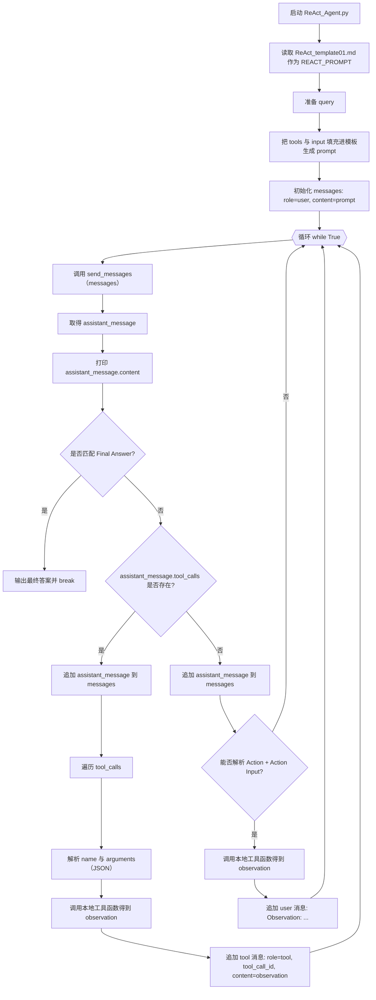

# ReAct_Agent 整体逻辑说明

本文档描述 [`ReAct_Agent.py`](file:///root/workspace/python_project/vllm_server/agent_tests/ReAct_Agent.py) 的端到端流程，并用 Mermaid 绘制流程图，方便快速理解“提示词驱动的 ReAct 循环 + Function Calling”的组合实现方式。

## 入口与依赖

核心文件与角色：

- [`ReAct_Agent.py`](file:///root/workspace/python_project/vllm_server/agent_tests/ReAct_Agent.py)：主循环，负责拼装 Prompt、维护 messages、解析模型输出、执行工具并把结果回写给模型。
- [`prompt/ReAct_template01.md`](file:///root/workspace/python_project/vllm_server/agent_tests/prompt/ReAct_template01.md)：ReAct 模板，包含 `{tools}` 与 `{input}` 两个占位符。
- [`registed_tools.py`](file:///root/workspace/python_project/vllm_server/agent_tests/registed_tools.py)：工具“声明”，每个工具包含 `name/description/parameters`。
- [`tools.py`](file:///root/workspace/python_project/vllm_server/agent_tests/tools.py)：工具“实现”和 `send_messages()`，并将 `registed_tools.tools` 包装为 OpenAI SDK 需要的 `tools=[{"type":"function","function":...}]` 结构。

运行所需环境变量：

- `DeepSeek`：API Key（OpenAI SDK 需要 `api_key`，此项目从 `os.getenv("DeepSeek")` 读取）。

## Mermaid 流程图



## 关键数据结构

### 1) Prompt 模板占位符

模板文件里使用：

- `{tools}`：会被替换为 `json.dumps(tools)` 的字符串（其中 `tools` 来自 [`registed_tools.py`](file:///root/workspace/python_project/vllm_server/agent_tests/registed_tools.py)）。
- `{input}`：会被替换为本次用户问题 `query`。

拼装逻辑（概念上）：

1. 读取模板文本作为 `REACT_PROMPT`
2. `REACT_PROMPT.replace("{tools}", json.dumps(tools)).replace("{input}", query)`

### 2) messages（对话上下文）

`messages` 是一个 list，每个元素是 dict（或 OpenAI SDK 返回的 message 对象被追加进去）：

- `{"role": "user", "content": "..."}`
- `{"role": "assistant", "content": "..."}`
- `{"role": "tool", "content": "...", "tool_call_id": "..."}`

注意：当模型使用 Function Calling 返回 `tool_calls` 时，下一轮请求前必须追加对应的 `role="tool"` 消息，并且 `tool_call_id` 必须与返回的 `tool_calls[i].id` 一一对应，否则服务端会报 400。

## 两条“工具调用”路径

该脚本同时兼容两种风格的工具调用：

### 路径 A：Function Calling（优先）

触发条件：

- `assistant_message.tool_calls` 存在（说明模型走了结构化工具调用）。

处理方式：

- 先把 `assistant_message` 追加到 `messages`
- 对每个 `tool_call`：
  - 从 `tool_call.function.name` 取工具名
  - 从 `tool_call.function.arguments` 解析 JSON 参数
  - 在本地调用对应 Python 函数（例如 `get_score_by_name`）
  - 把结果作为 `{"role":"tool","content":..., "tool_call_id": tool_call.id}` 追加回 `messages`
- `continue` 进入下一轮循环，让模型看到工具结果并继续推理

这一条路径会满足 OpenAI/DeepSeek 对“tool_calls 必须被 tool 消息跟随”的协议要求。

### 路径 B：纯文本 ReAct 解析（兼容）

触发条件：

- `assistant_message.tool_calls` 不存在，但模型在文本里输出了类似：
  - `Action: xxx`
  - `Action Input: {...}`

处理方式：

- 用正则从 `assistant_message.content` 里提取 `Action` 与 `Action Input`
- 本地执行对应工具得到 `observation`
- 以 `{"role":"user","content": f"Observation: {observation}"}` 的形式把结果追加回去

这一条路径更接近模板里描述的经典 ReAct 循环（Action / Observation 都在自然语言里），但不具备 Function Calling 的结构化约束。

## 结束条件（Final Answer）

每轮模型回复后都会用正则匹配：

- `Final Answer:\s*(.*)`

一旦匹配成功：

- 打印 `最终答案`
- `break` 退出循环

## 如何运行

在项目根目录（`vllm_server`）下执行：

```bash
export DeepSeek="你的真实API Key"
uv run /root/workspace/python_project/vllm_server/agent_tests/ReAct_Agent.py
```

常见问题：

- 401：`DeepSeek` 未设置或 key 无效。
- 400（tool_calls 协议错误）：说明出现了“assistant 带 tool_calls，但后续没有正确追加 role=tool/tool_call_id”的消息序列问题。

